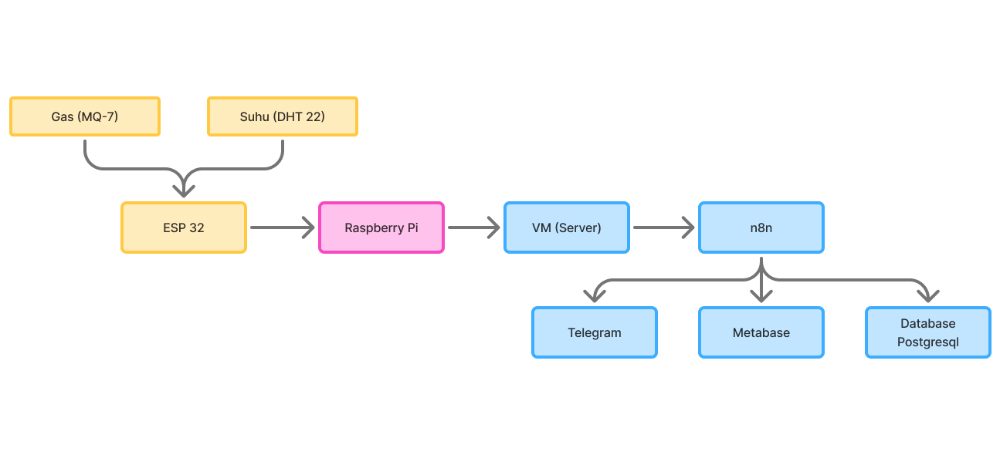
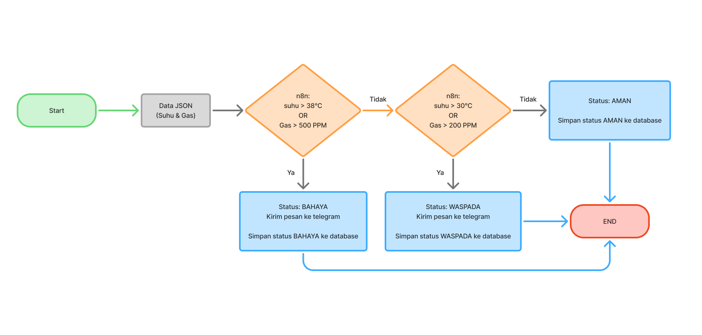
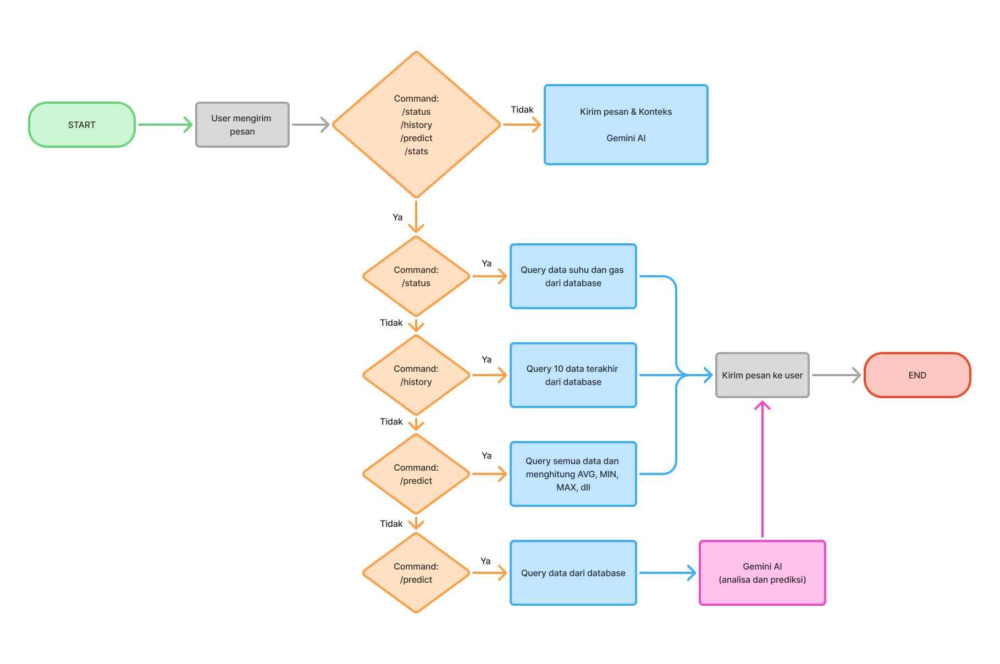

# Sistem Prediksi Bahaya Gas Beracun dan Anomali Termal pada Tambang Bawah Tanah berbasis AIoT

---

## Nama Anggota Kelompok

Azfarafi Gustiar Jati - 5024241037  
Ilan Hawwari Prasojo - 5024241039  
Anak Agung Ngurah Agung Kresna Ananta - 5024241085

---

## Deskripsi Proyek

### Latar Belakang & Masalah

Sektor tambang mineral dan batubara merupakan salah satu penopang utama perekonomian Indonesia. Namun, seiring menipisnya cadangan di permukaan, industri dipaksa beralih ke metode **tambang bawah tanah (*underground mining*)**. Lingkungan bawah tanah yang tertutup dan minim sirkulasi udara memiliki risiko kecelakaan kerja yang sangat tinggi.

Proyek ini dilatarbelakangi oleh tragedi nyata, salah satunya **Tragedi Tambang Emas Pongkor, Bogor pada Januari 2026**. Kebocoran gas beracun dan ledakan di area tambang tersebut menjadi bukti nyata bahwa metode monitoring konvensional masih memiliki celah fatal. Dua ancaman utama yang kami fokuskan adalah:

1. **Gas Beracun Tak Kasatmata:** Akumulasi gas berbahaya seperti Karbon Monoksida (CO) dan Hidrogen Sulfida ($\text{H}_2\text{S}$) yang memicu keracunan massal hingga ledakan tanpa disadari oleh pekerja.
2. **Anomali Termal:** Fluktuasi suhu abnormal yang menjadi indikator awal mesin mengalami *overheating* atau adanya potensi kebakaran tersembunyi di balik dinding tambang.

### Solusi yang Ditawarkan

Sistem mengklasifikasikan kondisi tambang bawah tanah ke dalam 3 tingkatan status menggunakan *Rule-Based Logic* berdasarkan pembacaan fisik sensor:

| Status | Batas Suhu (DHT22) | Batas Gas (MQ-6)* | Logika Sistem & Aksi |
| :--- | :--- | :--- | :--- |
| **AMAN** | < 30°C | < 200 PPM | **Kondisi Normal.** Suhu udara dan kadar gas berada dalam batas wajar untuk pekerja tambang.   *Aksi:* Data diarsipkan ke Database, Metabase diperbarui berkala. |
| **WASPADA** | 30°C - 38°C | 200 PPM - 500 PPM | **Deteksi Anomali Awal.** Sistem mendeteksi adanya indikasi pemanasan atau kebocoran gas secara bertahap.  *Aksi:* Sistem mengirim notifikasi peringatan awal (*statis*) ke Telegram. |
| **BAHAYA** | > 38°C | > 500 PPM | **Kondisi Kritis.** Risiko tinggi kebakaran atau kontaminasi gas mematikan yang mengancam nyawa.  *Aksi:* **Sistem memicu alarm evakuasi darurat otomatis** via Telegram. |

*> *Catatan: Pada prototipe ini digunakan MQ-6 sebagai Proof of Concept. Pada implementasi nyata akan menggunakan MQ-7 untuk mendeteksi ambang batas CO.*

---

## Flow System

### Sistem Prediksi Bahaya Gas Beracun dan Anomali Termal Tambang Bawah Tanah Berbasis AIoT

Sistem pemantauan dan prediksi berbasis AIoT (*Artificial Intelligence of Things*) yang dirancang untuk mendeteksi risiko gas berbahaya dan anomali termal di area tambang bawah tanah secara *real-time*.

### Flow Komunikasi Data

Alur komunikasi dimulai dari sensor gas dan suhu yang dibaca oleh ESP32. Data kemudian diteruskan ke Raspberry Pi, masuk ke VM/server, dan diproses oleh n8n. Dari n8n, data dapat dikirim ke Telegram sebagai kanal peringatan, disimpan ke PostgreSQL, serta divisualisasikan melalui Metabase.

### Flow Alert Status Keamanan

Setiap data JSON berisi nilai suhu dan gas diproses oleh n8n menggunakan logika ambang batas. Jika suhu melebihi 38°C atau gas melebihi 500 PPM, sistem memberi status **BAHAYA**, mengirim pesan ke Telegram, dan menyimpan status ke database. Jika suhu berada di atas 30°C atau gas di atas 200 PPM, sistem memberi status **WASPADA**. Jika seluruh parameter berada di bawah ambang tersebut, data disimpan sebagai status **AMAN**.

### Flow Chatbot Telegram

Chatbot Telegram menerima pesan pengguna dan membedakan antara perintah cepat dengan percakapan bebas. Perintah seperti `/status`, `/history`, `/predict`, dan `/stats` mengambil data dari database untuk dikirim kembali ke pengguna. Jika pesan tidak termasuk perintah yang dikenali, konteks percakapan diteruskan ke Gemini AI agar pengguna tetap dapat bertanya secara natural tentang kondisi tambang, riwayat sensor, atau rekomendasi tindakan.

---

## Arsitektur Sistem (Berdasarkan Flowchart)

Sistem ini dirancang dengan alur data sekuensial dari pengumpulan data fisik hingga visualisasi akhir dan sistem peringatan:

1. **Edge Layer (Pengumpulan Data)**
   * **Sensor Gas (MQ-7 pada rancangan / MQ-6 pada prototipe):** Mendeteksi konsentrasi gas berbahaya di area tambang.
   * **DHT22 Sensor:** Mengukur suhu (Celsius) dan kelembaban udara.
   * **ESP 32:** Membaca data dari kedua sensor secara *real-time*.

2. **Network Layer (Transmisi Data)**
   * **Raspberry Pi:** Menjadi penghubung awal dari perangkat ESP32 menuju server.
   * **VM / Server:** Menyediakan lingkungan eksekusi untuk layanan backend dan otomasi.

3. **Backend & Storage Layer (Pengolahan Utama)**
   * **n8n (Backend):** Menerima data sensor, menjalankan logika klasifikasi status, dan mengatur alur integrasi.
   * **Database (Raw Data):** n8n memasukkan data sensor mentah yang diterima ke dalam database untuk diarsipkan.

4. **Intelligence & Notification Layer (Alerting & Chatbot)**
   * **Static Alerting System (n8n):** Engine *backend* menggunakan logika *rule-based* (IF-ELSE) untuk memantau ambang batas bahaya secara *real-time*. Jika anomali terdeteksi, sistem langsung menembakkan pesan peringatan darurat (menggunakan *template* statis) ke Telegram guna menjamin kecepatan transmisi (*zero delay*) dan keandalan informasi.
   * **Interactive AI Chatbot (Gemini LLM):** Terintegrasi di dalam bot Telegram sebagai asisten K3 virtual. Setelah menerima *alert* darurat, pengawas atau pekerja dapat langsung berinteraksi dengan AI untuk menanyakan detail situasi, meminta panduan evakuasi yang spesifik, atau menganalisis konteks data terkini secara natural.
   * **Database (Event Logging):** Setiap *alert* yang terpicu dan riwayat interaksi anomali disimpan ke dalam *database* untuk keperluan audit K3 dan pelaporan.

5. **Frontend & Visualization Layer (Monitoring)**
   * **Metabase (Frontend):** Bertindak sebagai *user interface* utama yang menarik data hasil prediksi dari database untuk disajikan dalam bentuk *dashboard* visual interaktif bagi manajemen tambang.

## Parameter Standar Acuan Status Keamanan

Sistem mengklasifikasikan kondisi tambang bawah tanah ke dalam 3 tingkatan status berdasarkan kombinasi pembacaan fisik sensor dan logika ambang batas pada n8n:

| Status | Batas Suhu (DHT22) | Batas Gas (Sensor Gas) | Logika Sistem & Aksi |
| :--- | :--- | :--- | :--- |
| **AMAN** | < 30°C | < 200 PPM | **Kondisi Normal.** Suhu udara dan kadar gas berada dalam batas wajar untuk pekerja tambang.   *Aksi:* Data diarsipkan ke Database, Metabase diperbarui berkala. |
| **WASPADA** | 30°C - 38°C | 200 PPM - 500 PPM | **Deteksi Anomali Awal.** Sistem mendeteksi adanya indikasi anomali termal atau kenaikan gas secara bertahap.  *Aksi:* Mengirim notifikasi awal ke Telegram dan menyimpan status ke database. |
| **BAHAYA** | > 38°C  *(Panas ekstrem/kebakaran)* | > 500 PPM  *(Gas beracun pekat)* | **Kondisi Kritis.** Risiko tinggi kebakaran bawah tanah atau kontaminasi gas yang mengancam nyawa.  *Aksi:* **Telegram langsung memicu alarm darurat secara otomatis** untuk evakuasi pekerja. |

Dalam standar keselamatan kerja (K3) tambang, kita harus menggunakan Prinsip Garis Pertahanan Terlemah (Worst-Case Scenario). Artinya, jika salah satu parameter sudah masuk zona merah/kuning, maka status keseluruhan harus langsung naik ke level tersebut demi keselamatan nyawa pekerja, tidak boleh dirata-rata.

---

### Fitur Chatbot & Alert Telegram

Sistem notifikasi pada Telegram Bot ini beroperasi menggunakan pendekatan **Hybrid (Static Push + AI Conversational Pull)** untuk memastikan keseimbangan antara kecepatan peringatan dan kedalaman informasi:

1. **Push Notification (Static Alerting):** Saat parameter lingkungan menyentuh batas Waspada atau Bahaya, sistem otomatis mengirimkan *template* pesan darurat yang tegas dan konsisten agar pekerja bisa langsung merespons tanpa menunggu waktu *generate* teks dari AI.
2. **Pull Request (Interactive AI Chatbot):** Setelah peringatan diterima, pekerja/pengawas dapat membalas pesan bot tersebut. Di sinilah AI (Gemini LLM) mengambil alih untuk menjawab pertanyaan situasional (misal: *"Jalur evakuasi mana yang paling aman sekarang?"* atau *"Berapa lama gas menyentuh angka ini?"*).

Selain *chat* natural dengan AI, pengguna juga dapat menggunakan perintah cepat berikut untuk informasi *on-demand*:

* `/status` — **Data Sensor Terkini:** Menampilkan nilai *real-time* dari sensor MQ-6 dan DHT22, serta status lingkungan terakhir.
* `/history` — **Riwayat Data Terbaru:** Menampilkan ringkasan data suhu dan gas terbaru dari database.
* `/predict` — **Analisis dan Prediksi:** Mengambil data historis dari database, menghitung nilai AVG, MIN, dan MAX, lalu meminta Gemini AI memberikan analisis kondisi.
* `/stats` — **Statistik Sensor:** Menyajikan metrik seperti suhu rata-rata, puncak kadar gas, dan ringkasan kondisi lingkungan.

---

## Cara Menjalankan Proyek

Bagian ini memandu Anda untuk menjalankan proyek ini di lingkungan lokal.

### 1. Prasyarat (Prerequisites)

Pastikan sistem Anda telah menginstal:

* PlatformIO IDE (VS Code) untuk *flashing* ESP32.
* Python 3.8+ (untuk menjalankan Gateway MQTT).
* Akun n8n (Local/Self-hosted atau Cloud) & Kredensial Bot Telegram.

### 2. Setup Perangkat Keras (Hardware)

* Rangkai ESP32 dengan DHT22 (Pin 32) dan MQ-6 (Pin 36 / VP).
* _Upload_ kode C++ yang ada di folder `/esp32_firmware` menggunakan PlatformIO.

### 3. Setup Gateway (Raspberry Pi / Laptop)
1. Buka terminal dan masuk ke direktori `/gateway`.
2. Instal *library* yang dibutuhkan: `pip install paho-mqtt pyserial python-dotenv`.
3. Sesuaikan file `.env` (Port Serial, IP Broker, Token API).
4. Jalankan script: `python gateway.py`

### 4. Setup n8n & Metabase

* Impor file `n8n_workflow.json` (jika ada) ke dalam dashboard n8n Anda.
* Hubungkan database PostgreSQL ke Metabase untuk menampilkan dashboard visual.

---

## Foto Alat

Berikut adalah dokumentasi fisik dari alat/perangkat keras yang telah dirakit dan digunakan dalam proyek ini:

| Pandangan Atas | Pandangan Samping / Detail Komponen |
| :---: | :---: |
| <!-- Masukkan tag foto di sini, contoh: -->  |  |

*Keterangan: Berikan sedikit penjelasan mengenai foto alat di atas, misalnya wadah yang digunakan atau posisi peletakan sensor.*

---

## Stack / Tech yang Digunakan

### Perangkat Keras (Hardware & Komponen Elektronika)

* **Mikrokontroler:** ESP32 (Internal Wi-Fi module)
* **SBC / Gateway:** Raspberry Pi 4
* **Sensor:** Sensor Gas MQ-6 & Sensor Suhu/Kelembaban DHT22
* **Komponen Pendukung:**
  * Breadboard (Papan Prototiping)
  * Kabel Jumper (Male-to-Male / Male-to-Female)
  * Kabel USB Type-C (Power & Flashing)
  * Resistor 220 Ohm & Resistor 1k Ohm (Pull-up / Pembagi Tegangan)

### Perangkat Lunak & Cloud (Software Stack)

* **Protokol Komunikasi:** MQTT (Format Payload: JSON)
* **Backend Integration Engine:** n8n Workflow Automation
* **Artificial Intelligence:** Gemini 2.5 LLM/Prediction Model via API
* **Database Management System:** PostgreSQL
* **Data Visualization Tool:** Metabase (Frontend Dashboard)
* **Alerting Platform:** Telegram Bot API

---

## Video Demo & Dashboard Metabase

